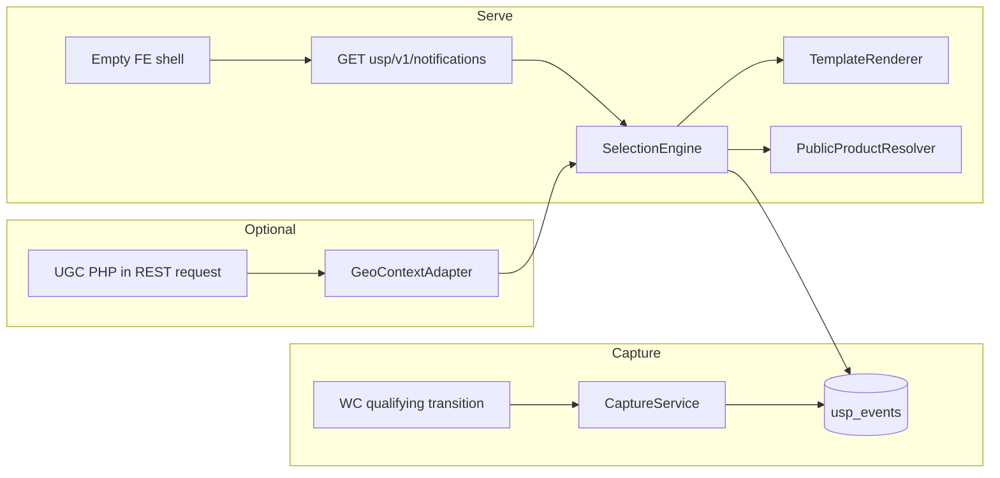
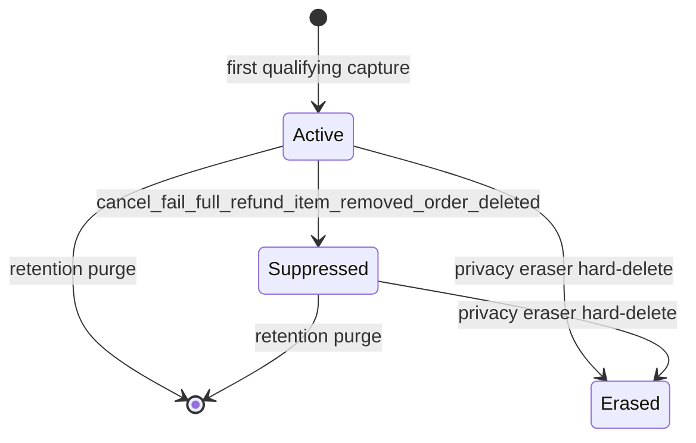

# Universal Social Proof — Architecture Specification (FROZEN)

> **Status: FROZEN**  
> **Approved by Product Owner**  
> This document is the authoritative implementation specification for Universal Social Proof **M0–M7**.  
> Changes to frozen architecture require an explicit amendment/ADR or a new approved specification; implementation must not silently diverge.

**Plugin name:** Universal Social Proof  
**Slug / repo:** `universal-social-proof`  
**Freeze basis:** Product Owner–approved Freeze Candidate (narrow third correction: terminal suppression; M1 `occurred_at` characterization; `{{quantity}}` in M4).

See also: [GOVERNANCE.md](../GOVERNANCE.md) · [roadmap/README.md](../roadmap/README.md) · [adr/README.md](../adr/README.md)

---

## 1. Executive recommendation

Standalone Universal* WooCommerce plugin: capture genuine paid line-item events → minimized internal record → server-side selection + template render → cache-safe REST (small DTO) → vanilla JS presentation.

**v1 geography: purchase country only.** No city, no region in schema or display. Visitor geo via soft Universal Geo Context (UGC) **country** weighting only.

Compelling v1 copy:

> Someone in Sweden purchased Tirzepatide 10mg — 14 minutes ago

No fabricated purchases. No Telegram / Universal Product Reviews / MP Commerce Fulfillment bus dependency. Works without UGC.

---

## 2. Environment / repository findings

| Fact | Value |
|------|-------|
| WordPress | **7.1** |
| WooCommerce | **11.0.1** |
| PHP (web) | **8.3.32** (CLI image may be 8.4 — ignore for runtime target) |
| Theme | **blocksy-child** 1.2.13 |
| Plugins root | `/opt/biopentra/dev/<slug>/` |
| FPC | `/wp-json/` must bypass |
| Existing social-proof plugin | None at freeze time |

**Admin capability inventory (documented at freeze; USP choice locked):**

| Plugin | Cap | Menu |
|--------|-----|------|
| Universal Geo Context | `manage_options` | Top-level |
| Universal Site Announcements | `manage_options` | Own |
| Universal Product Reviews | `manage_woocommerce` | **Under WooCommerce** |
| Universal Multicurrency | mostly `manage_woocommerce` | Woo-oriented |

**USP locked:** capability `manage_woocommerce`; menu **under WooCommerce** (matches UPR; PO decision). Not a new auth model.

**Conventions to mirror:** standalone repo, Composer `magpern/universal-social-proof`, PSR-4 `UniversalSocialProof\`, HPOS declare, PHPUnit unit+integration, ADRs, vanilla FE, version/tag workflow per §15.

---

## 3. Integration seams

**UGC (soft):** `universal_geo_get_country_code()` / `universal_geo_get_region_code()` / `universal_geo_get_context()`; REST context endpoint. v1 uses **country only** for visitor weighting. Region API may exist but is unused until a future region milestone beyond M0–M7.

**Not dependencies:** Telegram order emitters, UPR invitation hooks, MPCF intake (hook/idempotency precedents only).

**Precedents:** MPCF dual paid hooks + unique index; UPR Schema/Migrator; USA token grammar + a11y bar; UGC ADR-0012 cache-safe REST.

---

## 4. Architecture



**Owns:** capture, storage, selection, server-side templates, product/page targeting, FE presentation, admin, diagnostics, retention, privacy erasure hooks.

**Does not own:** general geolocation, city/region heuristics in v1, fabricated events, generic multi-event platform.

**Package sketch (implementation from M0 onward):** `Capture/`, `Storage/`, `Selection/`, `Rest/`, `Template/`, `Frontend/`, `Admin/`, `Geo/`, `Privacy/` (incl. personal-data), `Cleanup/`.

---

## 5. Data model

Table `{prefix}usp_events`.

### Field classes

**A. Internal provenance (never in public DTO / HTML / public diagnostics)**

| Column | Role |
|--------|------|
| `id` | Internal PK |
| `source_order_id` | WC order id — lifecycle, refunds, erasure join |
| `source_item_id` | Line item id — idempotency key half |
| `status` | `active` \| `suppressed` |
| `suppress_reason` | Machine code (nullable when active) |
| `captured_at` | USP insert time (UTC) — operational |
| `updated_at` | Last status change (UTC), e.g. suppress time |

**B. Event / selection keys**

| Column | Role |
|--------|------|
| `public_id` | **UUIDv4** string (RFC 4122), generated at insert; only public event id |
| `product_id` / `variation_id` | Public presentation + eligibility |
| `quantity` | Original purchased qty at capture — **immutable**; feeds `{{quantity}}` in M4 |
| `country_code` | ISO purchase country (billing, else shipping) |
| `occurred_at` | Authoritative commerce event time (UTC) — exact resolver frozen in **M1** after WC characterization (see §6) |

**C. Explicitly absent in v1 schema (M0–M7)**

- `region_code`, `city_*`, snapshot `product_name` / permalink

Future region/city = new product milestone + migration beyond this freeze, not nullable placeholders “just in case.”

**Indexes:** `UNIQUE (source_order_id, source_item_id)`; `UNIQUE (public_id)`; `(status, occurred_at)`; `(status, country_code, occurred_at)`; `(status, product_id, occurred_at)`.

**Retention:** 7–90 days, default 60; cron purges by `occurred_at` (ADR may confirm clock; recommend **`occurred_at`** for “how old is this proof”).

**Docs language:** minimized store with **internal provenance** + **event keys**; public DTO is a separate projection. Do not call the whole row a “privacy-safe snapshot.”

**Guarantees:**

1. Provenance columns (`source_order_id`, `source_item_id`, internal `id`) **never** appear in REST, HTML, public diagnostics, or browser-facing logs.  
2. Public surface uses `public_id` only.  
3. Purchase country comes from WooCommerce order address data. Never buyer IP geolocation for historical purchase events.

---

## 6. Capture lifecycle

### Timestamps

| Field | Definition |
|-------|------------|
| `occurred_at` | Immutable authoritative commerce time for the purchase fact. Persisted once on first insert; never updated on duplicate hooks or partial refunds. Exact resolver **not prescribed in this freeze** — see M1 prerequisite below. |
| `captured_at` | USP wall-clock at successful insert. Ops/diagnostics/backfill lag only; **not** used for “X minutes ago.” |

Relative-time UI, freshness weights, and retention clock use **`occurred_at` only**.

Backfill/replay (architecture allows; v1 may ship without a backfill UI): historical `occurred_at`; `captured_at = now`. An old purchase must not appear recent.

#### M1 prerequisite — characterize then freeze `occurred_at` resolver

Do **not** invent a nonexistent “status transition timestamp” during freeze or M0. M1 must:

1. Characterize WooCommerce 11 public APIs for order/payment dates (HPOS-safe).  
2. Freeze an exact deterministic resolver in an ADR, conceptually along:

   - paid timestamp when WooCommerce has one;  
   - otherwise a reliable public timestamp representing the qualifying commerce state **if** WC exposes one;  
   - otherwise order creation time.

3. Cover with tests at least:

   - normal online payment (`date_paid` present, `processing`);  
   - COD / manual payment (create → later `completed` / `processing` without early `date_paid`);  
   - direct transition into `completed`.

COD product implication (document in ADR after characterization): create Monday / complete Friday may yield Monday (`date_created`) or Friday (if a paid/completion stamp exists) depending on what WC actually exposes — **freeze the chosen rule from evidence**, not from improvisation.

This investigation is expected engineering work, not architecture drift ([GOVERNANCE.md](../GOVERNANCE.md) §6).

### Eligibility and idempotency

- Qualifying statuses (default): first entry into **`processing` ∪ `completed`**.  
- One row per `(source_order_id, source_item_id)`. Never a second record — including after terminal suppression (unique key remains; suppressed row blocks re-insert).

### Suppression state machine (locked — terminal)



**One purchase fact, one immutable event. Suppression is terminal.**

- No `suppressed → active`. Cancel / fail / full-refund / item-removed / order-deleted → suppress and stay suppressed.  
- Admin later moving the order back to `processing`/`completed` must **not** resurrect marketing content (no reactivate; no second row).  
- Order **deleted** (platform delete, not erasure): **suppress**; retention cron removes later. No default hard-delete.  
- Privacy erasure: **hard-delete** (see §7).

Rationale: avoids “19 days ago” resurrection after long cancellation gaps, and avoids reactivating rows already outside the `occurred_at` retention window.

### Refunds (immutable quantity)

| Case | Behaviour |
|------|-----------|
| Line still has remaining purchased qty after refunds (partial) | **Keep active**; **do not** rewrite `quantity` |
| Line fully refunded (refunded qty ≥ original qty) | **Suppress** (`refund_full`) — terminal |
| Order cancelled / failed | **Suppress** — terminal |
| Line item removed | **Suppress** that row — terminal |

Rationale: the event records what was genuinely purchased at `occurred_at`. Partial refunds do not rewrite history.

**`{{quantity}}` (v1 / M4):** supported in the token grammar; semantics = **original quantity purchased at `occurred_at`**. Default template **omits** it. Partial refund does not change the token value; full refund suppresses the event so it is not shown.

M1 characterizes WooCommerce refund line/qty APIs (HPOS-safe) to detect **full** line refund reliably.

### Product presentation at serve time

Resolve current public name, URL, thumbnail via `PublicProductResolver`. Exclude if deleted / private / unpublished / admin-excluded.

**Out of stock:** configurable exclusion; **default OFF**. OOS after a real purchase does not falsify the event; last-unit purchase is valid social proof.

### Guest checkout

Same path as registered; country from order address fields only. No buyer IP geo.

---

## 7. Privacy model

**v1 display:** country or none (“Someone purchased…”). No region, no city, no abbreviated names.

**Public DTO never includes:** provenance ids, emails, names, streets, order numbers, customer ids, IPs, region/city.

### Personal-data erasure / export (ADR required — precise mechanism)

USP cannot map email→rows alone. Integration pattern:

1. Hook WordPress personal-data eraser/exporter (and align with WooCommerce’s order personal-data handlers where appropriate).  
2. Given the request email/user, use **HPOS-safe WooCommerce order query APIs** (exact API confirmed in M1 ADR against WC 11) to list order ids in scope.  
3. Delete (eraser) or report (exporter policy) USP rows where `source_order_id` ∈ that set.  
4. If WC has already removed orders before USP runs, document fail-closed behaviour (no orphan scan by email in USP table — table has no email column).

Exporter content: prefer minimal — e.g. that marketing social-proof records linked to orders were removed/listed without re-emitting rich marketing copy as “personal data”; exact payload in privacy ADR.

`wp_add_privacy_policy_content()` describes country-level display, retention, internal order linkage for lifecycle/erasure, no names/emails/IPs in notifications.

Do **not** claim GDPR compliance by coarsening geography alone.

---

## 8. Selection algorithm

1. **Indexed prefilter** from `usp_events`: `status=active`, within retention, optional `country_code` / `product_id` constraints, recent window → candidate ids (bound N ≈ 50–100).  
2. **Weighted shortlist** using stored dimensions only (country match, freshness from `occurred_at`, product_id hints from request) → reduce to a **resolution budget** (e.g. shortlist ≤ 15–20 ids) **before** any `wc_get_product`.  
3. **Resolve products** only for that shortlist; drop ineligible (unpublished/private/deleted/excluded; OOS only if setting on).  
4. **Pick K** (default 5, hard cap **10**) for the response.

Selection happens **server-side**. The browser does not receive the full candidate pool.

M2 acceptance: explicit **query/product-resolution budget** (max product loads per REST request) covered by tests/guards.

Freshness weights use `occurred_at`. Never rewrite timestamps to look newer.

**Relative time copy (always genuine `occurred_at`):** just now / X minutes ago / X hours ago / X days ago (within retention).

---

## 9. UGC integration

```php
interface GeoContextAdapter {
  public function country_code(): ?string;
  public function is_available(): bool;
}
```

- Soft dependency; Null adapter → global selection. Plugin operates without UGC.  
- Prefer UGC PHP inside USP REST (one browser round-trip).  
- **M5 acceptance gate:** under real DEV proxy (SWAG/Cloudflare real-IP), USP REST + `universal_geo_get_country_code()` resolves the **requesting visitor**. Do not trust client-supplied country.  
- v1 ignores UGC `region_code` for matching (no purchase region stored).

---

## 10. Cache-safe delivery and REST inputs

Empty shell in HTML; events only via REST; `Cache-Control: no-store`. Visitor-specific / notification payloads must **not** be embedded into full-page-cached HTML.

| Param | Validation |
|-------|------------|
| `product_id` | Optional positive int |
| `page_context` | Optional allowlist enum; invalid → `unknown` |
| `exclude` | Max 20 UUIDv4 strings; drop malformed |
| `limit` | Clamp 1..10; default 5 |

**Accurate trust statement (locked):**

- Server-side **enqueue** controls normal UX (e.g. no script on checkout when disabled).  
- REST `page_context` **influences selection** (e.g. PDP prefer current product when context is `product` + `product_id`).  
- `page_context` is **not an authorization boundary**. Clients can lie; returned data is intentionally public marketing content. Do not design pseudo-security around the assertion.

---

## 11. Front-end

Vanilla JS for presentation and rotation. SessionStorage for shown ids / dismiss; pass `exclude`. No anonymous server writes. No bounce; respect `prefers-reduced-motion`; avoid assertive live-region spam.

Templates render **server-side**; the front end must not re-implement template token semantics.

**Public DTO (M4):** `public_id` (UUIDv4), `product_url`, optional `thumbnail_url`, `occurred_at` (ISO), server-rendered plain-text `message`, boolean `show_relative_time`.

- When `show_relative_time` is **true**, the client shows its existing relative-time chrome and may refresh it from `occurred_at` only.
- When `show_relative_time` is **false**, the server message already consumed `{{time_ago}}`; the client suppresses separate relative-time chrome for that notification (no duplicated time).
- `show_relative_time = ! used_time_ago` from the template renderer; do not infer from message text.

**M2 note (2026-08-30 PO-approved clarification):** M2 ships the base allowlist (`public_id`, `product_url`, `thumbnail_url`, `occurred_at`) only — no `message`. See ADR-0011 amendment 2026-08-30.

**M4 note (2026-08-31 PO-approved clarification):** M4 additively introduces `message` and `show_relative_time`. `{{location}}` is an alias of purchase-country display for `{{country}}` under country-only v1. See ADR-0011 amendment 2026-08-31.

---

## 12. Admin

Under **WooCommerce** submenu. Capability: `manage_woocommerce`. Sections: General, Display, Content/Templates, Products, Targeting, Geography (country on/off), Privacy, Diagnostics.

Diagnostics: counts, oldest/newest `occurred_at`, capture lag samples (`captured_at - occurred_at`), schema, UGC state, cleanup — **no** order ids in UI.

---

## 13. Security / privacy

- Cap `manage_woocommerce` + nonces  
- Public DTO allowlist; provenance never crosses boundary  
- **`public_id` = UUIDv4** (not Hashids; not sequential)  
- Prepared SQL; server-side escape on template render  
- Input caps; resolution budget  

---

## 14. Performance

- No WC order queries on storefront page render  
- Indexed prefilter → shortlist → bounded product resolves → K≤10  
- Optional object-cache of recent active id/country projection (not per-visitor)  

---

## 15. Milestone roadmap and versioning

| Milestone | Version | Objective |
|-----------|---------|-----------|
| M0 | `0.0.0` | Scaffold, CI, ADRs, HPOS, capability/menu ADR |
| M1 | `0.1.0` | Capture, country-only schema; **characterize+freeze `occurred_at` resolver**; terminal suppress; refunds; erasure; retention |
| M2 | `0.2.0` | Selection + REST + resolution budget + UUIDv4 |
| M3 | `0.3.0` | FE toaster |
| M4 | `0.4.0` | Templates (incl. `{{quantity}}`) + product/page targeting |
| M5 | `0.5.0` | UGC visitor-country weighting + country display privacy + erasure hardening + REST geo gate |
| M6 | `0.6.0` | Full admin + diagnostics |
| M7 | **`1.0.0`** | Hardening, acceptance, **first production-recommended complete v1** |

Versions are **cumulative**. M7 intentionally jumps from `0.6.0` to **`1.0.0`**. There is **no M8** in this freeze.

Freeze tags: `mN-…-freeze`. Release tags: `v0.N.0` for M1–M6; **`v1.0.0`** for M7. Header / `USP_VERSION` / changelog must agree on the tagged commit.

### Milestone notes

**M1 out:** region/city columns, REST selection UI, FE, UGC weighting, reactivation.  
**M1 gate:** `occurred_at` resolver ADR frozen from WC API characterization + payment-path tests before capture code is considered done.  
**M2:** product-resolution budget is an acceptance criterion. **M2 DTO omits `message`** (PO-approved 2026-08-30; M4 adds it additively). See ADR-0011 amendment.  
**M4:** token grammar includes `{{product}}`, `{{location}}`/`{{country}}`, `{{time_ago}}`, **`{{quantity}}`** (original qty); default template omits quantity. `{{location}}` = purchase-country alias (country-only v1). Public DTO adds `message` + `show_relative_time` (chrome coordination). Checkout **excluded** by default; **PDP prefer current product** (PO accepted).  
**M5 out:** region/city; client-supplied geo.  
**M7:** ships **`1.0.0`** (not `0.7.0`).

Detailed roadmap: [roadmap/README.md](../roadmap/README.md).

---

## 16. Key ADRs

Required topics (see [adr/README.md](../adr/README.md)):

1. Purpose/boundaries (genuine-only; country-only v1; city/region deferred)  
2. Soft UGC / Null adapter  
3. Storage: provenance vs event keys vs public projection  
4. `occurred_at` vs `captured_at`; backfill-safe; **exact resolver Requires M1 evidence**  
5. Unique key + **terminal** suppress state machine (no reactivation; no second row)  
6. Refunds: full suppress / partial retain / immutable quantity; `{{quantity}}` = original qty  
7. Personal-data eraser via WC order lookup (HPOS-safe) — mechanism detail Requires M1 evidence  
8. Cache-safe REST; input caps; `page_context` not authz  
9. `public_id` = UUIDv4  
10. Selection pipeline + product-resolution budget; OOS default off  
11. Server-side templates (M4 token grammar incl. `{{quantity}}`)  
12. Admin capability + WooCommerce submenu  
13. Versioning: `0.N.0` → `1.0.0` at M7  
14. Extensibility without generic event platform  

Do not fabricate WooCommerce implementation evidence to close M1-gated decisions during M0.

---

## 17. Product Owner decisions — RESOLVED

| Decision | Resolution |
|----------|------------|
| v1 geography | **Country only** (no region/city in v1) |
| PDP behaviour | **Prefer current product** |
| Quantity | Stored immutable; **`{{quantity}}` in M4 grammar**; **omitted from default template** |
| Plugin name | **Universal Social Proof** |
| Admin placement | **Under WooCommerce** |
| Release | M0 `0.0.0`; M1–M6 `0.1.0`–`0.6.0`; M7 **`1.0.0`** |

These decisions are **closed**. Do not reopen them as open questions. Future region/city are new product milestones beyond M0–M7, not silent scope creep.

---

## 18. Risks

| Risk | Mitigation |
|------|------------|
| Ambiguous `occurred_at` on COD/manual/direct-complete | M1 characterization prerequisite + frozen ADR + path tests |
| Admin re-opens cancelled order | Terminal suppress; unique key blocks new row; no marketing resurrection |
| Erasure without resolvable orders | Documented fail-closed; WC API characterization |
| UGC wrong in REST behind proxy | M5 acceptance gate |
| N+1 product loads | Mandatory shortlist budget in M2 |
| `page_context` lying | Accepted; not an authz boundary |
| Low volume | Quiet mode / diagnostics |

---

## 19. Naming

| Item | Value |
|------|-------|
| Name | Universal Social Proof |
| Repo / slug / text domain | `universal-social-proof` |
| Composer | `magpern/universal-social-proof` |
| Namespace | `UniversalSocialProof\` |
| Constants | `USP_` |
| REST | `universal-social-proof/v1` |
| Table | `{prefix}usp_events` |
| Hook prefix | `usp_` |
| `public_id` | UUIDv4 |

---

## 20. Fake / custom events

**Locked:** administrators **cannot** create purchase-looking notifications. Future non-purchase types (if ever) must use distinct copy and templates that cannot be mistaken for a purchase. Fabricated purchase events are outside the product boundary and must not be introduced as an implementation convenience.

---

## Explicitly frozen decisions (checklist)

- Genuine purchase events only; no fabricated/custom purchase notifications  
- Country-only geography in v1; no region or city fields in the v1 schema  
- Purchase country from WooCommerce order data; visitor country optionally from UGC (soft dependency)  
- Custom `{prefix}usp_events`; provenance separated from public projection  
- `public_id` is UUIDv4; one event per `(source_order_id, source_item_id)`  
- Suppression is terminal; no `suppressed → active`  
- Distinct `occurred_at` / `captured_at`; exact `occurred_at` resolver is an **M1 characterization requirement**  
- Partial refund retains; full line refund suppresses; original `quantity` immutable  
- M4 supports `{{quantity}}` (original qty); default template omits quantity  
- Current public product presentation at serve time; OOS exclusion configurable, default OFF  
- Server-side selection; REST K ≤ 10; bounded product-resolution shortlist  
- `page_context` is a selection hint, not authorization  
- Cache-safe REST; no visitor-specific notification payload in FPC HTML  
- Server-side templates; vanilla JS front end  
- Admin under WooCommerce; capability `manage_woocommerce`  
- Checkout excluded by default; PDP prefers current-product events  
- M7 → **v1.0.0**; no generic event-platform abstraction in v1  
