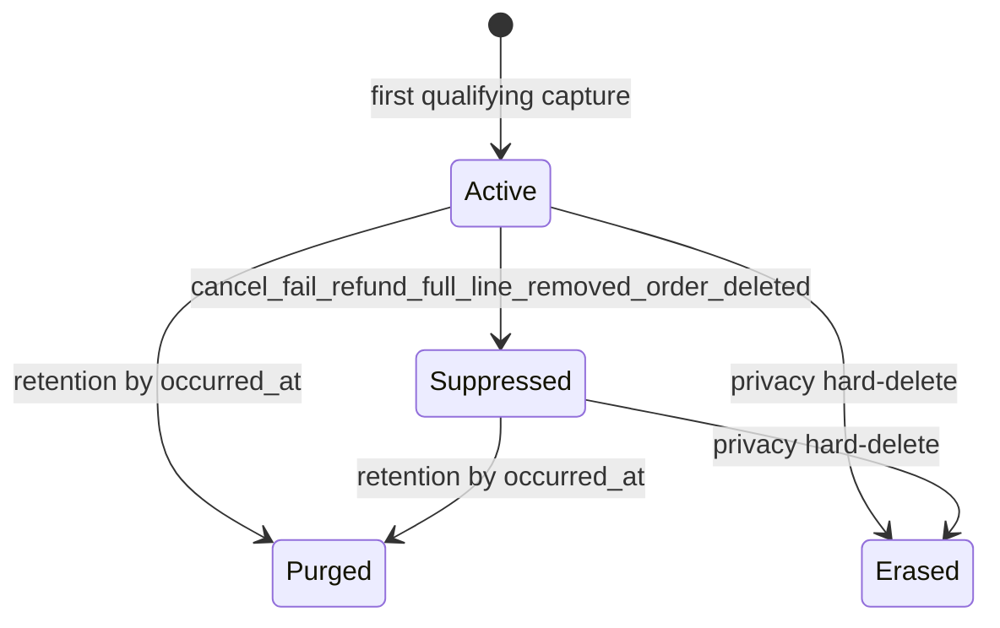

# Universal Social Proof — M1 Capture + Storage Plan

**Status:** FROZEN for M1 implementation  
**Baseline `main`:** `5c7baf96bb25778beab0bfd04aa67a48b99107ba`  
**Target version:** `0.1.0`  
**Branch:** `feature/m1-capture-storage`

This document is the authoritative M1 milestone specification underneath `docs/architecture/FROZEN.md`. Do not redesign during implementation.

---

## 1. Executive recommendation

Implement M1 as an HPOS-safe capture + storage layer that records one immutable purchase fact per order line item in `{prefix}usp_events`, with terminal suppression, qty-based full-refund detection, WordPress privacy hard-delete (prospective dual-path), and Action Scheduler retention purge by `occurred_at`.

**No mandatory PO stop conditions.** Engineering corrections from review are incorporated below.

---

## 2. Verified M1 baseline

| Item | Value |
|------|-------|
| PR #1 | **MERGED** 2026-08-29 |
| Merge / `origin/main` / local HEAD | `5c7baf96bb25778beab0bfd04aa67a48b99107ba` |
| Branch | `main`, clean, in sync |
| Tags | none |
| M0 present | yes (`0.0.0` scaffold) |
| M1 started | **no** |

**Authoritative M1 baseline SHA:** `5c7baf96bb25778beab0bfd04aa67a48b99107ba`

---

## 3. Frozen requirements (do not reopen)

Genuine-only; one row per `(source_order_id, source_item_id)`; country-only geo; immutable original `quantity`; terminal suppress; UUIDv4 `public_id`; distinct immutable `occurred_at` / `captured_at`; no product presentation snapshots; no fake events; no M2 REST/FE/selection/UGC/templates.

---

## 4. WooCommerce 11.0.1 characterization evidence

**Source:** DEV install `/opt/biopentra/data/wordpress/html/wp-content/plugins/woocommerce/` **11.0.1**; HPOS enabled on DEV.

| Topic | Class | Finding |
|-------|-------|---------|
| Date getters | Observed | `get_date_paid/created/completed/modified()` → `WC_DateTime\|null` |
| `date_paid` set | Observed | `payment_complete()` and `maybe_set_date_paid()` on transition to paid target status; **not** at BACS/cheque checkout (`on-hold`); COD often unpaid until later `completed` |
| Status-transition timestamp API | Observed absent | Do not invent one |
| Status hooks | Observed | Fire **after** `parent::save()` in `WC_Order::save()` → `status_transition()` |
| `processing→completed` | Observed | Re-fires every real transition |
| Line qty type | Observed | `WC_Order_Item_Product::set_quantity()` stores via `wc_stock_amount()` → **`int\|float`** (filter `woocommerce_stock_amount`); not hard-integer |
| Refunds | Observed | `get_qty_refunded_for_item()` returns **negative** sum (may be float); full line = `abs(refunded) >= ordered qty` |
| Refund delete under HPOS | Observed gap | No reliable public delete hook; **irrelevant for reactivation** (terminal suppress) |
| Line delete | Observed | `woocommerce_before_delete_order_item( $item_id )`; resolve order via `wc_get_order_id_by_order_item_id` **before** delete |
| Order delete | Observed | `woocommerce_before_delete_order` / `woocommerce_before_trash_order` (`$id`, `$order`) |
| Privacy query | Observed | `wc_get_orders([ 'customer' => [ $email, $user_id ] ])` (same as WC) |
| WC order anonymize | Observed | Clears `billing_email` + `customer_id` when erasure enabled; fires `woocommerce_privacy_before_remove_order_personal_data` **first** with live order |
| Default WC erase orders | Observed | Option default **`no`** |

---

## 5. Exact recommended `occurred_at` resolver

**Engineering recommendation** (freeze in ADR-0004 during implementation):

```
resolve_occurred_at( WC_Order $order ): ?DateTimeImmutable  // UTC instant

1. $paid = $order->get_date_paid( 'edit' )
   if $paid instanceof WC_DateTime → return from $paid->getTimestamp()
2. else $completed = $order->get_date_completed( 'edit' )
   if $completed instanceof WC_DateTime → return from $completed->getTimestamp()
3. else $created = $order->get_date_created( 'edit' )
   if $created instanceof WC_DateTime → return from $created->getTimestamp()
4. else → null   // FAIL CLOSED — never fabricate commerce time with time()/now
```

If resolver returns `null`: **do not insert** the event; log internal non-PII diagnostic (order id allowed in operator log only). `captured_at` is the only wall-clock “now” field and must never substitute for `occurred_at`.

Store non-null values as MySQL `datetime` UTC: `gmdate( 'Y-m-d H:i:s', $ts )`.

| Path | Behavior |
|------|----------|
| Online paid | Prefer `date_paid` |
| COD/BACS at first `processing` without paid | `date_created` |
| Later `completed` that sets `date_paid` | **Do not update** existing row |
| Direct `completed` | `date_paid` → `date_completed` → `date_created` |
| Historical replay | Same resolver; historical `occurred_at`; `captured_at = now` |
| No authoritative timestamp | Skip capture (null) |

**Reject:** `date_modified`; **reject:** `time()` / “now” as `occurred_at`.

---

## 6. Capture hook recommendation

**Single primary seam:** `woocommerce_order_status_changed` (`$order_id`, `$from`, `$to`, `$order`).

Capture when `$to ∈ { processing, completed }` (and `$from !== $to`).

**Rationale (observed):** Qualifying paths persist then fire this hook after save; items/dates available. `woocommerce_payment_complete` alone misses COD/BACS-style `update_status` paths. Prefer one seam; UNIQUE + post-insert re-eval handle duplicates/races.

**Do not** capture on `on-hold` / `pending`.

---

## 7. Event lifecycle / state machine



- No `suppressed → active`
- Qualifying status after suppress: no second insert (UNIQUE)
- No suppress-only orphan rows when no prior qualifying capture
- Capture that races a terminal order **converges to suppressed** (see §22)

**`suppress_reason` vocabulary (varchar):** `cancelled` | `failed` | `refund_full` | `line_removed` | `order_deleted`

---

## 8. Exact database schema

Table `{prefix}usp_events` (`$wpdb->get_charset_collate()`):

| Column | Type | Null | Notes |
|--------|------|------|-------|
| `id` | `bigint(20) unsigned` AUTO_INCREMENT | NO | PK |
| `source_order_id` | `bigint(20) unsigned` | NO | provenance |
| `source_item_id` | `bigint(20) unsigned` | NO | provenance |
| `status` | `varchar(16)` | NO | `active` \| `suppressed` |
| `suppress_reason` | `varchar(32)` | YES | null when active |
| `public_id` | `char(36)` | NO | UUIDv4 |
| `product_id` | `bigint(20) unsigned` | NO | parent product id |
| `variation_id` | `bigint(20) unsigned` | YES | NULL if simple |
| `quantity` | `decimal(18,6)` | NO | original purchased qty; WC-compatible |
| `country_code` | `char(2)` | YES | ISO; null if none |
| `occurred_at` | `datetime` | NO | UTC |
| `captured_at` | `datetime` | NO | UTC |
| `updated_at` | `datetime` | NO | UTC; lifecycle mutations |

**Quantity type freeze (from WC evidence):** WooCommerce line quantities are `int|float` via `wc_stock_amount()` / `woocommerce_stock_amount` filter. USP **must not** silently `(int)`-truncate. Store as `DECIMAL(18,6)`; read/compare as float. Skip capture only when normalized quantity is `<= 0`.

**Indexes:**
- `PRIMARY KEY (id)`
- `UNIQUE KEY source_order_item (source_order_id, source_item_id)`
- `UNIQUE KEY public_id (public_id)`
- `KEY status_occurred (status, occurred_at)`
- `KEY status_country_occurred (status, country_code, occurred_at)`
- `KEY status_product_occurred (status, product_id, occurred_at)`

No region/city/PII/JSON blob/product name snapshot.

---

## 9. Migration strategy

Mirror UPR Schema/Migrator:

- Option `usp_db_version` (string, e.g. `20260829m1`)
- `dbDelta` from `Schema::table_definitions()`
- Activation **and** controlled runtime upgrade in `Plugin::init()` when version behind (cheap compare + lease lock)
- Bump option only after successful `dbDelta`
- Idempotent; integration tests for create + re-run

---

## 10. Capture algorithm (`CaptureService::capture_order`)

For each `line_item` in `$order->get_items( 'line_item' )`:

1. Skip non-product lines  
2. If repository already has `(order_id, item_id)` → **noop** (including suppressed)  
3. **Pre-check (optimization, not invariant):** if order currently `cancelled`/`failed`, or this line is already fully refunded by qty → skip insert  
4. Resolve `occurred_at`; if `null` → skip line (fail closed); log  
5. `product_id` / `variation_id` from line item APIs (variation_id NULL if 0)  
6. `quantity` = `(float) $item->get_quantity()` after ensuring `> 0` (no int cast)  
7. Country via extractor  
8. `captured_at` / `updated_at` = UTC now; `public_id` = `wp_generate_uuid4()`  
9. Idempotent `INSERT`; on duplicate key → re-select; **do not** rewrite immutables  
10. **Post-insert re-evaluation (required invariant):** re-load order (or use same object) and evaluate terminal conditions for this item (cancelled, failed, cumulative full refund, missing item). If terminal → immediately `suppress_item` with the matching reason  

Missing product object at capture: still insert using IDs from the line item.

Wrap in try/catch; never rethrow into WC checkout.

---

## 11. UUIDv4 strategy

`wp_generate_uuid4()` (core). UNIQUE on `public_id`; on collision retry insert once then fail soft (log). No Composer UUID package.

---

## 12. Country extraction

```
billing = strtoupper( trim( $order->get_billing_country( 'edit' ) ) )
if preg_match( '/^[A-Z]{2}$/', billing ) → billing
else shipping = strtoupper( trim( $order->get_shipping_country( 'edit' ) ) )
if preg_match( '/^[A-Z]{2}$/', shipping ) → shipping
else null
```

No IP / UGC / customer-account geo.

---

## 13. Product / variation identity

| Case | `product_id` | `variation_id` |
|------|--------------|----------------|
| Simple | line `get_product_id()` | NULL |
| Variation | parent id from line | variation id |
| Deleted product later | keep stored IDs | unchanged |

Do not require `get_product()` success at capture.

---

## 14. Cancellation / failure suppression

Hooks: `woocommerce_order_status_cancelled`, `woocommerce_order_status_failed` → suppress all rows for `source_order_id` with reason `cancelled` / `failed`.

Idempotent UPDATE `status=suppressed`, set reason/`updated_at` WHERE `status=active`. Never insert suppress-only orphans.

---

## 15. Refund algorithm

Hooks: `woocommerce_order_refunded`, `woocommerce_order_partially_refunded`, `woocommerce_order_fully_refunded` → for each USP line on order:

```
$refunded = abs( (float) $order->get_qty_refunded_for_item( $item_id ) );
$ordered  = $item ? (float) $item->get_quantity() : (float) $stored_quantity;
if ( $ordered > 0 && $refunded >= $ordered ) → suppress reason refund_full
else → leave active; never rewrite quantity
```

No `(int)` truncation. Refund deletion under HPOS: **no reactivation** (frozen). Document hook gap as limitation only.

---

## 16. Line-removal handling

`woocommerce_before_delete_order_item`: resolve `$order_id = wc_get_order_id_by_order_item_id( $item_id )`; suppress that item (`line_removed`).

---

## 17. Order-deletion handling

`woocommerce_before_trash_order` + `woocommerce_before_delete_order`: suppress all events for order (`order_deleted`). Untrash does **not** reactivate.

---

## 18–19. Privacy exporter / eraser + ordering

**Exporter (minimal):** For matched orders’ USP rows, export “Purchase social-proof record” with `occurred_at`, `country_code`, `quantity`, `public_id` — **not** `source_order_id` / `source_item_id` / internal `id`.

**Eraser dual-path (no PII in USP table) — prospective guarantee:**

1. Register on `wp_privacy_personal_data_erasers` at **priority 5** (before WC’s default 10): paginated `wc_get_orders([ 'limit'=>10, 'page'=>$page, 'customer'=>[ $email, $user_id? ] ])` → hard-delete USP by those order IDs.  
2. Hook `woocommerce_privacy_before_remove_order_personal_data`: hard-delete by `$order->get_id()` when WC is about to anonymize that order.

**ADR-0007 must state precisely:**

- **Prospective erasure is guaranteed** through USP’s registered eraser + Woo pre-anonymization hook while the identifying relationship is still recoverable.  
- **Retrospective association cannot be reconstructed** after WooCommerce has already irreversibly anonymized/deleted the identifying relationship (email/`customer_id`) and USP never previously erased those rows (e.g. USP installed later). Fail closed; no email column on `usp_events`; do not invent PII storage.

**Not a PO stop** for M1, but **not** “complete coverage of already-anonymized historical orders.”

---

## 20. Retention recommendation

**Actual retention execution is in M1.** Quotes:

- Roadmap M1 objective: “…erasure hooks; **retention**” → tag `v0.1.0`  
- FROZEN §15 M1: “…erasure; **retention**”  
- FROZEN §6: order delete → suppress; “**retention cron** removes later”

Option `usp_retention_days` default **60**, clamp **7–90** (no admin UI in M1; UI in M6).

Action Scheduler daily (WC required) → bounded `DELETE … WHERE occurred_at < cutoff LIMIT 100`. Purge active and suppressed equally. Age clock = `occurred_at` only. Classes: `RetentionPurger` + `RetentionScheduler`.

---

## 21. Repository / storage abstraction

`EventRepository` (`$wpdb` prepared):

- idempotent insert + duplicate handling  
- `find_by_source( order_id, item_id )`  
- `suppress_item` / `suppress_order`  
- `delete_by_order_ids( int[] )`  
- retention range delete by `occurred_at`  
- no M2 selection APIs

---

## 22. Concurrency / idempotency (convergent)

UNIQUE `(source_order_id, source_item_id)` prevents duplicate facts. Suppress via conditional UPDATE on `status=active`.

**Capture vs suppression race — required algorithm:**

Pre-insert status checks are **optimization only** (TOCTOU remains). Deterministic convergence:

1. Refuse/skip when current order/item is already terminal (**best-effort**).  
2. Insert idempotently when proceeding.  
3. **Always re-evaluate terminal state after successful insert** (cancel/fail + cumulative full refund + item gone).  
4. If terminal → suppress immediately.

Thus: suppress-before-insert no-op + later capture still ends **suppressed**, not active. Test explicitly: capture racing cancellation; capture racing full refund.

No distributed locks.

---

## 23. Backfill / replay boundary

M1: `CaptureService::capture_order( WC_Order $order ): void` callable from hooks and future CLI. **No** WP-CLI/UI backfill required for M1 acceptance. Same null-safe `occurred_at` + post-insert re-eval.

---

## 24. Error / logging strategy

Never throw out of hooks. `wc_get_logger()` source `universal-social-proof`. Log skipped-null-`occurred_at` and insert failures without PII. Missing schema: controlled migrate once; else skip capture.

---

## 25. Performance

Per transition: O(N) lines. Refund: O(N) qty checks. Privacy/retention paginated. No full-table scans on checkout path.

---

## 26. Concrete file / class plan

```
src/Storage/Schema.php
src/Storage/Migrator.php
src/Storage/EventRepository.php
src/Capture/OccurredAtResolver.php      # returns ?DateTimeImmutable
src/Capture/CountryExtractor.php
src/Capture/CaptureService.php          # insert + post-insert terminal re-eval
src/Capture/LifecycleHooks.php
src/Privacy/PersonalDataExporter.php
src/Privacy/PersonalDataEraser.php
src/Cleanup/RetentionPurger.php
src/Cleanup/RetentionScheduler.php
```

Wire from `Plugin::init()`; activation migrate in main file. Version bump to `0.1.0` in closure commit before PR.

---

## 27. Test matrix (high level)

- Schema: create, indexes/uniques, `decimal` quantity, idempotent migrate  
- Capture: processing, completed, processing→completed no dup, multi-line, simple/variation, country, UUID, captured_at  
- `occurred_at`: paid; COD without paid → created; direct completed; replay; immutability; **null → no row**  
- **Races:** capture after/during cancel → suppressed; capture during/after full refund → suppressed  
- Suppress: cancel, fail, full refund, repeat, no reactivate, no recreate  
- Refunds: partial active; cumulative full suppress; float qty; quantity unchanged  
- Delete: order trash/delete; line remove  
- Privacy: lookup, hard delete, pagination, exporter shape, before_remove path; document fail-closed when orders already anonymized/unfindable  
- Retention: purge by `occurred_at`, respects retention days  
- Scope guards: no REST notifications, no FE, no UGC, no templates  

---

## 28. Docs / ADR updates (during implementation)

- Amend **ADR-0004**: exact resolver `paid → completed → created → null` (fail closed) + evidence → Accepted  
- Amend **ADR-0007**: `wc_get_orders` customer query + dual-path + **explicit retrospective limitation** → Accepted  
- Note quantity `DECIMAL(18,6)` as engineering freeze under ADR-0006 / milestone notes  
- CHANGELOG / README / M1 closure  
- Commit [`M1-CAPTURE-STORAGE-PLAN.md`](docs/milestones/M1-CAPTURE-STORAGE-PLAN.md) as first docs commit on the M1 branch  

Do **not** rewrite FROZEN.md.

---

## 29. Version / tag strategy

Close at **`0.1.0`**. Per ADR-0013 / roadmap: release tag **`v0.1.0`**.

**Tag only after merge to `main`**, at the approved merge commit (or the main tip that contains the M1 closure). Never tag an unmerged feature-branch commit.

Header / `USP_VERSION` / CHANGELOG must agree on the tagged commit. M7 remains first production-recommended `v1.0.0`.

---

## 30. Implementation sequence

1. Commit plan doc on `feature/m1-capture-storage` from `5c7baf9`  
2. Schema + Migrator + activation/runtime upgrade  
3. Repository + UUID + country + nullable `occurred_at`  
4. CaptureService (convergent post-insert re-eval) + status hook  
5. Suppression + refunds + deletes  
6. Privacy dual-path + ADR-0007 limitation text  
7. Retention AS worker  
8. Tests (incl. races + null resolver) + CI policy updates  
9. Version `0.1.0`, ADR amendments, closure docs  
10. **PR → review/CI → merge → verify `main` → tag `v0.1.0` on that main commit**

---

## 31. Acceptance criteria (summary)

Table exists with frozen shape including `DECIMAL` quantity; qualifying orders produce one row per line; idempotent; resolver matches §5 (null skips); post-insert re-eval enforces terminal suppress under races; refund float qty semantics; privacy prospective hard-delete without USP PII; retrospective anonymized-history limitation documented; retention purge by `occurred_at`; HPOS-safe public APIs only; version `0.1.0`; tag after merge; M2+ surfaces absent; ADRs 0004/0007 closed from evidence.

---

## 32. Explicit M2+ exclusions

No notification REST, SelectionEngine, FE toaster, templates/tokens, UGC weighting, admin diagnostics UI, fake events, region/city.

---

## 33. Risks / limitations

| Risk | Mitigation |
|------|------------|
| COD `occurred_at` = create time at first processing | Documented; WC public clocks; immutable |
| Capture vs suppress TOCTOU | Post-insert terminal re-eval (§22); tests |
| Null timestamps | Fail closed; no fabricated `occurred_at` |
| HPOS refund-delete hooks incomplete | Terminal suppress; no reactivate |
| Privacy after irreversible WC anonymization | Fail closed; document in ADR-0007; no PII in USP |
| Capture exception breaks checkout | Never rethrow; logger only |

---

## 34. Open Product Owner decisions

**None required** for M1 start.

---

## 35. Recommended branch / commits

- Branch: `feature/m1-capture-storage` from `5c7baf9`  
- Commits: `docs: freeze M1 capture plan` → schema → capture → lifecycle → privacy+retention → tests → `docs: close M1` + version  
- PR → merge → **then** `git tag v0.1.0` on `main`

---

## Review correction changelog

1. Capture/suppress race: convergent post-insert re-eval (not status-check-as-invariant).  
2. Privacy: prospective guarantee only; retrospective anonymized history fail-closed + ADR-0007 wording.  
3. `occurred_at`: terminal fallback is `null` / skip capture (not `time()`).  
4. Quantity: `DECIMAL(18,6)` + float compare; no silent `(int)` truncation (WC `wc_stock_amount` evidence).  
5. Retention AS worker confirmed in M1 via FROZEN §15 + roadmap wording.  
6. Tag `v0.1.0` only after merge to `main`.

---
