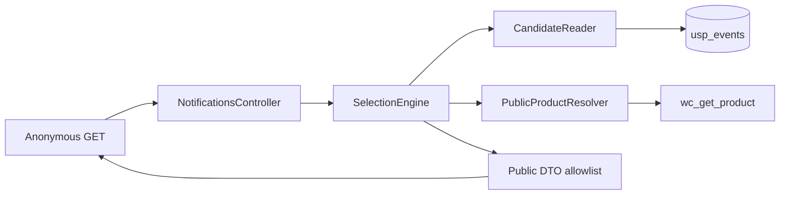

# Universal Social Proof — M2 Selection + REST Plan

**Status:** FROZEN for M2 implementation  
**Baseline `main`:** `1587032c271825fc47e1a230896edff03f0705b5`  
**Target version:** `0.2.0`  
**Branch:** `feature/m2-selection-rest`

This document is the authoritative M2 milestone specification underneath `docs/architecture/FROZEN.md`. Architecture-review corrections are incorporated. Product Owner approved the `message` clarification (omit in M2; M4 adds it additively). Do not redesign during implementation.

---

## 1. Executive recommendation

Implement M2 as an anonymous, cache-safe **read** API over genuine M1 `usp_events` rows. Selection is server-side, bounded, and fail-closed to an empty list.

**Frozen numeric constants**

- Global candidate `LIMIT`: **80**
- PDP preferred extra `LIMIT`: **20**
- Preferred and global pools kept **separate** through shuffle and resolution (not merged-then-walked)
- Product-resolution budget: **20** USP-initiated `wc_get_product()` calls per request
- PDP search resolution cap: **5** (preferred-pool uncached loads, after the 1 request-product resolve)
- `K`: default **5**, min **1**, max **10**; numeric `limit` **clamped** 1..10 per FROZEN §10
- `exclude`: max **20** UUIDv4; malformed dropped; >20 rejected
- Duplicate **products** allowed; unique **events** (`public_id`) required
- `catalog_visibility=hidden` → ineligible
- Variation→parent fallback **only if the variation no longer resolves**
- OOS exclusion: **OFF** (option + filter; no admin UI)
- Freshness: apply current retention cutoff on `occurred_at` in SQL (**option B**)
- Schema: **no change**, no new index
- `page_context`: `product` | `unknown` only

**Route (authoritative, not the prompt shorthand `usp/v1`):** `GET /wp-json/universal-social-proof/v1/notifications` (ADR-0008 and FROZEN §19). The mermaid in FROZEN §4 is abbreviated.

**M2 is not the toaster.** No JS, CSS, templates, UGC, or admin UI.

**PDP invariant (not an unconditional slot):** if an eligible preferred event is found within the PDP search resolution cap, one result slot is reserved for it; global candidates cannot consume that search budget first.

**One remaining documentation obligation (approved, not optional):** FROZEN §11 / ADR-0011 include `message` in the public DTO; M4 owns templates. **PO approved 2026-08-30:** omit `message` in M2; M4 adds it additively. Record that as an ADR-0011 amendment and FROZEN §11/§15 note during M2 implementation docs — the milestone plan does not silently override FROZEN.

---

## 2. Verified repository baseline

After `git fetch origin` (2026-08-30):

- Branch: `main`, clean, tracking `origin/main`
- Local HEAD = `origin/main` = `1587032c271825fc47e1a230896edff03f0705b5` (`docs: record M1 closed on main with v0.1.0`)
- Remote: `https://github.com/magpern/universal-social-proof.git`
- PR #2: merged as `0151f1d5d679bfbc89f3a7b4b0489fbef7a0222d`
- Tag `v0.1.0`: annotated tag object `68b76e5`; peeled commit **`0151f1d5d679bfbc89f3a7b4b0489fbef7a0222d`** (matches M1 closure)
- M1 closure doc present; status **CLOSED**; production untouched
- M2 not started: no `src/Selection`, `src/Rest`; [scripts/ci/check.sh](scripts/ci/check.sh) forbids those directories and `register_rest_route` / `SelectionEngine`; tests assert no USP REST routes
- No local uncommitted work; no sync required

**Authoritative M2 planning baseline SHA:** `1587032c271825fc47e1a230896edff03f0705b5`

Repository state matches expected M1 closure. Proceed.

---

## 3. M1 state relevant to M2

Table `{prefix}usp_events` (`usp_db_version` = `20260829m1`):

- Columns: `id`, `source_order_id`, `source_item_id`, `status` (`active`|`suppressed`), `suppress_reason`, `public_id` CHAR(36) UUIDv4, `product_id` (parent), `variation_id` (NULL if simple), `quantity` DECIMAL(18,6), `country_code` CHAR(2) NULL, `occurred_at` / `captured_at` / `updated_at` UTC datetime
- Indexes: PK `id`; UNIQUE `(source_order_id, source_item_id)`; UNIQUE `public_id`; `(status, occurred_at)`; `(status, country_code, occurred_at)`; `(status, product_id, occurred_at)`
- No `variation_id` index (not needed if PDP SQL matches `product_id` parent)
- Active vs suppressed: `status` column; M2 SQL **must** use `status = 'active'`
- Retention: default 60 days (clamp 7–90) via `usp_retention_days` + `usp_retention_days` filter; purge by `occurred_at` in batches of 100 (Action Scheduler). Delayed/failed purge can leave stale active rows
- `EventRepository` is a lifecycle writer (insert, find-by-source/order, suppress, erase, purge). M1 plan §21: **no M2 selection APIs** on this class
- Capture never requires a live product object; deleted products can still have active rows
- Privacy: no PII in table; public surface must never emit provenance columns
- Logger: `UniversalSocialProof\Logger` via `wc_get_logger()`, source `universal-social-proof`

---

## 4. Frozen M2 requirements (do not reopen)

From [docs/architecture/FROZEN.md](docs/architecture/FROZEN.md), ADR-0008, ADR-0009, ADR-0010:

- Genuine M1 events only; no fake/demo/manual purchase writers
- Indexed prefilter → candidate N ≈ 50–100 → stored-dimension shortlist → ≤15–20 `wc_get_product` → K ≤ 10
- Public id is UUIDv4 `public_id` only
- `page_context` is a selection hint, not authorization
- `Cache-Control: no-store`; empty HTML shell later (M3); events only via REST
- OOS exclusion configurable, default OFF
- PDP: prefer current product
- Geography: no visitor-country weighting (M5)
- Current product presentation at serve time; do not snapshot names from M1
- No toaster, templates, UGC, admin UI

---

## 5. WooCommerce 11.0.1 characterization evidence

Source: `/opt/biopentra/data/wordpress/html/wp-content/plugins/woocommerce/` **11.0.1**.

**`wc_get_product( $id )`** ([wc-product-functions.php](file:///opt/biopentra/data/wordpress/html/wp-content/plugins/woocommerce/includes/wc-product-functions.php)): factory lookup; `false`/`null` if missing; must not run before `woocommerce_init`. Public API. **This is the only product-resolution primitive M2 may use.**

**`WC_Product::is_visible()` / `is_visible_core()`:** catalog visibility **and** `is_search()` (REST request context, not the visitor page) **and** `woocommerce_hide_out_of_stock_items` **and** `current_user_can( 'edit_post' )` for non-publish. **Do not use for anonymous REST eligibility.** Shop managers would see drafts; search-only products would fail in REST; global OOS hide would override USP’s OOS-default-OFF.

**`is_purchasable()`:** `exists() && (publish || current_user_can) && price !== ''`. Encodes price + capability, not “was this a real purchase.” **Do not require.** Empty price is merchandising, analogous to OOS.

**`is_in_stock()`:** `stock_status !== outofstock` (filterable). Backorder counts as in stock. **Use only when OOS exclusion is ON.**

**`is_on_backorder()`:** `stock_status === onbackorder` or managed stock below zero with backorders allowed. When OOS exclusion is ON, backorder remains eligible (`is_in_stock()` true).

**`get_permalink()`:** `get_permalink( $id )` for simples; variations use parent permalink + encoded attribute query args ([class-wc-product-variation.php](file:///opt/biopentra/data/wordpress/html/wp-content/plugins/woocommerce/includes/class-wc-product-variation.php)). **Use this; do not concatenate URLs.**

**`get_image()`:** returns **HTML**, default size `woocommerce_thumbnail`, default `$placeholder = true` → `wc_placeholder_img()`. **Do not put HTML in the DTO.** Use `get_image_id()` + `wp_get_attachment_image_url( $id, 'woocommerce_thumbnail' )`. Variation `get_image_id( 'view' )` falls back to parent image.

**`variation_is_visible()`:** publish **and** non-empty price. Too strict for social proof (empty price). Do not use as the sole eligibility gate.

**`exists()`:** `false !== get_status()` — true for trash if the object loaded. **Insufficient alone.**

**Password:** `get_post_password()` is a public WC API. Non-empty → skip (not publicly viewable).

**Catalog visibility:** `visible` | `catalog` | `search` | `hidden`. Hidden still has a direct URL (WC comment). UPR excludes hidden from public reviewability — same merchandising intent.

**Statuses:** `publish` is the only public storefront status. draft/pending/private/trash/future/auto-draft → ineligible.

All of the above are public APIs. No private WC internals required.

---

## 6. Existing M1 storage/query assessment

`EventRepository` should stay a capture/lifecycle writer.

**Do not** add a generic query builder or turn it into an ORM.

**Do not** add M2 selection/prefilter methods to `EventRepository`. M1 plan §21 already forbids that. A later inspection suggestion to “just add `find_active_*` on `EventRepository`” is rejected: keep write/lifecycle separate from the bounded public-read query.

**Smallest clean boundary:** a dedicated read class in `Selection/` that uses `Schema::events_table()` and `$wpdb->prepare`, plus a typed `CandidateQuery` value object.

M2 may **read** rows (never update/insert/delete). Selection must not mutate M1 rows when a product is currently ineligible.

---

## 7. Proposed M2 architecture



No `TemplateRenderer`, `GeoContextAdapter`, or frontend in this path.

---

## 8. Exact selection pipeline

Order is mandatory. **Preferred and global pools stay separate through resolution.** Do not merge-shuffle all 100 then walk: that can spend the entire 20-call budget on global candidates before a preferred event is resolved.

For a **product** request (`page_context=product` and a positive `product_id`):

```text
validate REST
→ resolve request product (budget 1)
→ fetch preferred ≤20 (SQL; skip if parent id unknown)
→ fetch global ≤80 (SQL)
→ shuffle each pool independently
→ PDP search: resolve shuffled preferred first until
     one eligible preferred event is found
     OR preferred pool exhausted
     OR PDP_SEARCH_RESOLUTION_CAP (5 uncached preferred loads) reached
→ if found, reserve that event as slot 1
→ resolve shuffled global for remaining K-1 (skip already-selected public_ids)
→ if still short, continue unused preferred then unused global with leftover budget
→ public DTO
```

For a **non-product** request: skip request-product resolve and preferred SQL; shuffle global only; walk until K or the full 20-resolution budget.

| Stage | Input max | Output max | DB | PHP | `wc_get_product` | Why this order |
|---|---|---|---|---|---|---|
| 1 Validate REST | 1 request | `SelectionRequest` | 0 | schema | 0 | Fail fast |
| 2 Resolve request product (PDP only) | 1 id | parent + optional variation | 0 | 1 | **1** (counts) | Map variation IDs to stored parent `product_id` |
| 3 Indexed PDP prefilter | 1 product | **20** rows | 1 SELECT | — | 0 | Preference rows even if they are not in the newest global 80 |
| 4 Indexed global prefilter | table | **80** rows | 1 SELECT | — | 0 | Recency window; UUID exclusions in SQL |
| 5 Shuffle each pool independently | 20 + 80 | same | 0 | two shuffles | 0 | Variation without `ORDER BY RAND()`; pools remain distinct |
| 6 PDP search (preferred pool only) | 20 | 0 or 1 reserved event | 0 | eligibility | **≤5 uncached** in this phase | Global cannot consume this slice first |
| 7 Global fill | 80 | up to K-1 | 0 | eligibility | remaining budget | Fill after preference is established or PDP search ends |
| 8 Optional leftover fill | leftover rows | K | 0 | eligibility | leftover budget | Only if still short of K |
| 9 Public DTO map | K | K | 0 | allowlist | 0 | Allowlist projection |

**Deterministic budget allocation** (`PRODUCT_RESOLUTION_BUDGET = 20`):

- Request-product resolve: **1** when PDP is attempted (counts even if the product is missing).
- `PDP_SEARCH_RESOLUTION_CAP = 5` uncached resolver increments on the preferred pool. Unused portion of this cap **returns** to the shared remainder (finding an eligible preferred on the first preferred load spends 1, not 5).
- After a PDP attempt: at least **14** of the original 20 remain for global/leftover fill if the full 5 PDP-search loads were used (`20 − 1 − 5 = 14`). For `K=10` that is 9 remaining slots with 5 invalid-product headroom.
- Non-PDP: all 20 go to the global walk.
- Cached lookups of an already-resolved product id do not increment the counter (same as §13).

**Why 5 for PDP search:** one success is the usual case; headroom for hidden/deleted preferred SKUs; 5 is ≤ preferred SQL LIMIT 20; not large enough that a pool of dead preferred SKUs starves `K-1` global fill.

**Invariant (test this, do not claim an unconditional slot):** if an eligible preferred event is encountered within the PDP search cap, it occupies one result slot. Global shuffle order cannot prevent that. If no preferred event becomes eligible within that cap (or the preferred pool is empty), there is **no** reserved slot — global fill uses the remainder.

**Why UUID exclusion is in SQL:** otherwise the 80/20 row budgets are wasted on already-seen events.

**Why shuffle before resolution, per pool:** newest-first would always resolve the same deleted products first.

**Why PDP SQL is extra:** a popular store’s newest 80 may contain zero of the current product.

If stage 2 product is missing: skip preferred SQL; treat as global-only with remaining budget 19.

---

## 9. Candidate-pool size recommendation

- **80** global (`CANDIDATE_GLOBAL_LIMIT`)
- **20** PDP preferred (`CANDIDATE_PREFERRED_LIMIT`)
- Pools are **not** union-shuffled; in-memory max is still 80+20 rows

Rationale: middle of frozen 50–100 for the main query; extra 20 is still within the architectural ≈100 bound; enough headroom vs K=10 and 20 resolutions.

Constants live in `CandidateQuery` / `SelectionEngine`, not magic numbers in SQL strings. Tests assert the `LIMIT` argument never exceeds these.

---

## 10. Candidate SQL / query strategy

**Chosen strategy:** recent bounded window (`ORDER BY occurred_at DESC LIMIT N`) then PHP shuffle.

Rejected:

- `ORDER BY RAND()` on the table — unbounded / filesort
- Random `OFFSET` — `OFFSET` on 100k rows still scans OFFSET+LIMIT
- ID-range sampling — extra min/max queries; bias after deletes; more code than the benefit
- Weighted recency sampling — overkill; USP needs credible variation, not cryptographic uniformity

**Global SQL** (conceptual):

```sql
SELECT public_id, product_id, variation_id, quantity, country_code, occurred_at
FROM {prefix}usp_events
WHERE status = %s
  AND occurred_at >= %s
  AND public_id NOT IN ( ... up to 20 %s ... )
ORDER BY occurred_at DESC
LIMIT 80
```

If `exclude` is empty, omit `NOT IN`.

**PDP SQL:** same plus `AND product_id = %d`, `LIMIT 20`, uses `status_product_occurred`.

**Selected columns:** event keys only. Never `id`, `source_*`, `status`, `suppress_reason`, `captured_at`, `updated_at`.

**Index used:** `status_occurred` for global; `status_product_occurred` for PDP. `NOT IN` is a filter on the already-range-limited set (max 20 uuids). Invalid UUIDs never reach SQL (dropped earlier), so they cannot broaden the query.

**Scale**

- 10 events: returns all active in-window rows
- 100: newest 80, then shuffle
- 10k / 100k+: still newest 80 in-window rows; older genuine purchases are rarely shown — correct for “recent purchase” proof
- Recency bias is intentional
- Duplicate `public_id`: impossible (UNIQUE)
- `country_code` is selected but unused for weighting (M5)

---

## 11. Query-plan / index evidence

Planning did **not** populate production or customer data. USP is not bind-mounted on DEV WordPress, so `wordpress-db` has no live `usp_events`.

**Expected plan (MariaDB 11.4, matching CI):**

- Global: `type=range`, `key=status_occurred`, `status='active'` equality + `occurred_at` range, `ORDER BY occurred_at DESC` satisfied by the same index (no filesort), `LIMIT 80` stops the range
- PDP: `key=status_product_occurred`
- Not covering (need `public_id`, `quantity`, etc.) — table lookup of ≤80 rows is acceptable
- No temp table required for this shape

**M2 acceptance:** integration test runs `EXPLAIN` on both queries against the test schema and asserts the chosen key is `status_occurred` / `status_product_occurred` (not `ALL`, not `RAND()`). That is the evidence capture, not a speculative new index.

**No additional M2 index.** `variation_id` remains unindexed; PDP SQL matches parent `product_id` after one request-product resolve.

---

## 12. Freshness eligibility

**Freeze: option B** — candidate SQL always includes `occurred_at >= RetentionSettings::cutoff_utc()`.

Reasons: FROZEN §8 already says “within retention”; Action Scheduler can lag; option can shrink from 90→7; stale active rows must not become “recent purchase” copy in M3. Clock is `occurred_at` only, never `captured_at` / `updated_at`.

Cutoff uses the same clamped 7–90 / default 60 path as purge. Changing the option immediately changes selection without waiting for DELETE.

---

## 13. Exact product-resolution budget

**`PRODUCT_RESOLUTION_BUDGET = 20`** (hard cap, all USP-initiated loads)

**`PDP_SEARCH_RESOLUTION_CAP = 5`** uncached preferred-pool loads (PDP requests only; excludes the request-product load).

Rationale: top of frozen 15–20; K≤10 plus headroom; separate PDP search slice so preference cannot be starved by global shuffle (see §8).

**Counts as one resolution:** every USP-initiated `wc_get_product()` through `PublicProductResolver`, including:

- request PDP product
- candidate variation
- parent fallback when the variation **no longer resolves** and USP calls `wc_get_product( parent_id )`

**Does not count:** WooCommerce-internal nested loads inside `get_image()` that USP did not call.

**Cache:** resolver memoizes by product id for the request. A second event with the same id does **not** increment the counter.

**Enforcement:** `ProductResolutionBudget` refuses further uncached loads at 20; engine stops resolving and returns whatever valid K it has (possibly 0). PDP search stops uncached preferred loads at 5 even if total budget remains. Tests inject a counting loader and a two-pool fixture that proves global cannot exhaust the budget before PDP search runs.

If budget would be exceeded, **do not resolve**; skip remaining candidates.

---

## 14. Product resolver semantics

`PublicProductResolver::resolve_for_event( product_id, variation_id ): ?PublicProduct`

Algorithm:

1. If `variation_id` is null: resolve `product_id` only. Eligible → present parent/simple. Else skip. Do not suppress the M1 row.
2. If `variation_id > 0`, resolve variation first (1 budget).
3. **Variation resolves** (`WC_Product` that `is_type( 'variation' )`):
   - public-eligible → present **the variation** (URL with attributes; `get_image_id('view')` may use parent image)
   - exists but **fails current public eligibility** (draft/private/hidden/password/OOS-when-ON, etc.) → **skip the event**. Do **not** fall back to parent. That would bypass the merchandising condition that made the purchased SKU ineligible.
4. **Variation no longer resolves** (`wc_get_product` false, or the object is not a variation): resolve **parent** `product_id` (1 more budget if uncached). If parent public-eligible, present the parent as historical product-family resilience. **Do not suppress the M1 row.**
5. Otherwise → `null` (skip candidate).

`PublicProduct` (internal): presentation product id, type (simple|variation), `permalink`, `thumbnail_url` (`?string`), `name` (M4 only), `is_in_stock`, parent id.

---

## 15. Product public-eligibility rule

Smallest correct **anonymous** rule (do **not** call `is_visible()` or `is_purchasable()`):

1. Loader returns a `WC_Product`
2. `get_status() === 'publish'`
3. `get_catalog_visibility() !== 'hidden'`
4. `get_post_password() === ''`
5. `get_permalink()` is a non-empty string
6. If presenting a variation: parent must also be `publish` (variation permalink is the parent URL). If parent is not publish, the variation is ineligible (skip event; no parent fallback — the variation **resolved**)
7. Virtual / downloadable: eligible if the above pass
8. No price / not purchasable: **eligible**
9. OOS: eligible unless exclusion ON (see §17)

Sibling confirmation (UPR `ProductReviewability`, USA `ProductToken`): publish + catalog visibility ≠ `hidden`; **none of UPR/UMC/USA call `is_visible()`**. USA also uses `is_post_publicly_viewable()`. **Do not apply that helper to the variation post:** WooCommerce registers `product_variation` with `'public' => false`, so `is_post_publicly_viewable( $variation )` is false for every variation and would skip all variation presentation. If used at all, apply it only to the parent `product` post. It also does **not** replace the password check (password-protected published posts still count as publicly viewable).

**Hidden is frozen ineligible.** FROZEN §6 / ADR-0010 say drop unpublished/private/deleted/excluded; they do not say hidden products remain eligible. A SKU with `catalog_visibility=hidden` must not be promoted merely because its permalink resolves. Catalog-only and search-only remain eligible (publicly listed in some contexts; REST must not use `is_search()`).

Draft/private/pending/future/trash/deleted → skip.

---

## 16. Variation / parent semantics

Frozen presentation:

```text
variation resolves + eligible     → present variation
variation resolves + ineligible    → skip event
variation no longer resolves       → parent may represent the historical
                                     product family if parent is eligible
simple/parent purchase              → evaluate parent normally
```

- Public URL: variation `get_permalink()` when presenting a variation; parent permalink when presenting parent
- Deleted variation, live parent: parent presentation — truthful at product-family level, resilience for catalogue deletion only
- Deleted parent (and variation gone or ineligible): skip
- Variation still exists but is hidden / password-protected / draft / OOS-when-exclusion-ON: **skip**, even if the parent would be eligible
- DTO does **not** expose raw `product_id` / `variation_id`

This is frozen. Not an open PO question.

---

## 17. OOS behavior

**Default OFF.** Stock must not remove candidates.

Non-UI boundary (no M6 screen):

- Option `usp_exclude_out_of_stock` default `'no'`
- Filter `usp_exclude_out_of_stock` (bool, after option)

When ON: drop if `! $product->is_in_stock()` on the **presented** product.

| State | OFF | ON |
|---|---|---|
| instock | eligible | eligible |
| outofstock | eligible | skip |
| onbackorder | eligible | eligible (`is_in_stock` true) |
| stock management disabled, status instock | eligible | eligible |
| variation OOS, variation still resolves | eligible | skip event (no parent fallback) |
| variation **deleted** (unresolvable), parent in stock | parent if eligible | parent if eligible (`is_in_stock`) |

---

## 18. Exact PDP-preference algorithm

Trigger: `page_context === 'product'` **and** request `product_id` is a positive integer. Not authorization.

**Identity**

1. Resolve request id (budget 1, counts even if missing). If missing: no preferred SQL; global-only with remaining 19.
2. If variation: `preferred_parent_id = parent_id`, `preferred_variation_id = request id`.
3. If simple/variable parent: `preferred_parent_id = request id`, `preferred_variation_id = null`.
4. SQL preferred pool: `product_id = preferred_parent_id` (index-friendly), LIMIT 20, same freshness/exclude as global.

**Walk order inside the preferred pool (before any global resolve)**

- Shuffle preferred independently of global.
- Variation request: walk events with `variation_id === preferred_variation_id` first (shuffled), then remaining preferred parent events (shuffled). Still one PDP search cap covering both.
- Parent request: walk all preferred shuffled.

**Resolution (pools never merged for walking)**

1. PDP search: resolve preferred candidates until one eligible event, preferred pool exhausted, or **5 uncached** preferred loads. That event, if found, is **reserved as one result slot**.
2. Global fill: shuffle global independently; skip `public_id`s already selected; resolve until `K` is filled or remaining budget is exhausted.
3. If still short of K: continue unused preferred, then unused global, with leftover budget. Repeats of the same product are allowed (§20).

**Cases**

- `limit=1`: reserved preferred if found within the PDP search cap; else one from global
- All fetched events are the current product: preferred pool is the source of the reserved slot; remaining slots may come from leftover preferred then global (often overlapping ids — skip duplicates by `public_id`)
- Preferred UUID excluded: not in SQL pool
- Preferred events whose variation/parent fails merchandising: skip those events; they count toward the 5 uncached loads if they caused a new `wc_get_product`
- Request product invalid: no reserved-slot search

**Not claimed:** an eligible preferred event always appears. The 20-call hard cap plus the 5-search cap means preference is **conditional** on being found in that slice.

Compared alternatives: weight-only boost (no enforceable slot); fill K from current product first (can monopolize the payload). Reserved-one-slot **after a bounded preferred search** is the meaning of “prefer”.

---

## 19. Randomization strategy

- SQL: deterministic recency (`occurred_at DESC`)
- PHP: independent `shuffle()` (or injected `Randomizer`) on the **preferred pool** and on the **global pool** — never one shuffle of a merged list before PDP search
- Not cryptographic
- Tests inject a deterministic shuffler **and** a fixture where global candidates would consume the full budget if walked first; assert the preferred eligible event is still selected when found within the PDP search cap
- If many invalid products: may return fewer than K; **never fabricate** to fill K

---

## 20. Duplicate-product policy

Architecture guarantees unique **events**, not unique products.

**Freeze: allow repeated presentation product ids. Require unique `public_id` only.**

Five recent genuine purchases of the same product are legitimate social proof. Soft uniqueness is not an M2 requirement: a streaming resolver cannot know whether skipping a duplicate would shorten K without extra passes or retained overflow, and that machinery is not needed to satisfy frozen M2.

Product diversity may be added later as a selection policy if UX evidence says repetition is excessive. Not in M2.

---

## 21. UUID exclusion semantics

- Values are UUIDv4 `public_id`s
- Validate with `wp_is_uuid( $value, 4 )` (core; version 4 only; lowercase hex in WP regex — M1 uses `wp_generate_uuid4()`)
- Max **20** entries in the request array **before** dropping malformed
- **>20 items:** `400` `rest_invalid_param`. FROZEN §10: “Max 20 UUIDv4 strings; drop malformed.” ADR-0008: “Validate and cap inputs: … exclude (max 20 UUIDv4).” Unlike `limit`, FROZEN does **not** say clamp for exclude, so over-max is rejected rather than truncated.
- **Malformed among ≤20:** **drop** (FROZEN §10: “drop malformed”). Do not reject the whole request. Do not pass invalid strings to SQL
- Duplicates in exclude: unique them
- Excluded id never returned
- Empty exclude: omit `NOT IN`

Wire format: WordPress REST `type => array` of strings. Accepts `exclude[]=` repeated params and CSV `exclude=uuid,uuid` via `rest_parse_request_arg`. Conventional WP REST. Not JSON-in-query.

---

## 22. REST route

```
register_rest_route(
  'universal-social-proof/v1',
  '/notifications',
  [
    'methods'             => WP_REST_Server::READABLE, // GET
    'callback'            => ...,
    'permission_callback'=> '__return_true',
    'args'                => ... schema ...
  ]
);
```

- Anonymous read; no nonce; no capability
- Do not register POST/PUT/PATCH/DELETE
- Tests: unauthenticated GET 200; POST `405`/`404`; no nonce header required
- Namespace matches ADR-0008, **not** `usp/v1`

Sibling REST/HTTP precedent (inspected, no runtime dependency):

- **UGC** is the only sibling with `register_rest_route`: `UniversalGeo\Rest\ContextController` — `__return_true`, GET only, `Cache-Control: no-store`, frozen DTO mapper distinct from internal `to_array()`, callable DI, no app rate limiter. Copy this skeleton.
- **UPR / UMC / USA** have no public REST. Closest analogues: UPR form 400-on-bad-fields; UMC admin ID lists **hard-refuse** when over cap (not silent truncate) — supports exclude `>20` → 400; USA `ProductToken(?callable $resolver)` is the product-resolver test-spy pattern.
- **No sibling validates inbound UUIDs** or REST array-vs-CSV `exclude`. USP must implement that from ADR-0008 / FROZEN §10 (`wp_is_uuid( $value, 4 )`).
- None of the four use `page_context`. Enum remains USP-owned: `product` | `unknown`.

---

## 23. Exact REST parameter schema

**`limit`**

Authoritative wording:

- FROZEN §10: `limit` | **Clamp 1..10; default 5**
- ADR-0008: “Validate and **cap** inputs: … `limit` (1..10, default 5)”

FROZEN uses the verb **clamp** for this param (it does **not** use “clamp” for `exclude` or `page_context`). Implement that literally. Do not reinterpret clamp as “400 outside the range” without a FROZEN amendment.

- Absent → 5
- `"5"` → 5 (WP integer sanitize of a numeric string)
- Numeric out of range: **clamp** — `0` and negatives → `1`; `11` / `999` → `10`
- Non-numeric string, array, object: **400** (malformed, not a clampable integer)
- Non-integer number (`5.9`): **400** via validate_callback if WP would otherwise coerce

`K` is the clamped value. Selection never returns more than that.

**`product_id`**

- Optional positive integer (`minimum` 1)
- Absent → no PDP product
- Present but not a positive integer → **400**
- Present, valid int, product does not exist → **200**, no preference (parse ≠ catalog existence)

**`page_context`**

- Frozen M2 enum: `product` | `unknown` (not an open PO item)
- Default when absent: `unknown`
- Invalid / unexpected string → **`unknown`** (FROZEN §10: “invalid → `unknown`”). **Do not use native REST `enum` validation** (it 400s). Custom sanitize maps unknown values to `unknown`
- Do not invent `shop` / `search` / `category` / `home` in M2. M4 targeting may add values additively later
- Only `product` plus a usable `product_id` enables preference

**`exclude`:** see §21. Default `[]`. `maxItems` 20.

---

## 24. Validation / error semantics

| Case | HTTP | Body |
|---|---|---|
| Valid, zero eligible | 200 | `[]` |
| Valid, 1–K events | 200 | array of DTOs |
| Malformed limit (non-integer / array) / invalid product_id / exclude count >20 | 400 | WP REST error; no SQL/paths/order ids |
| Numeric `limit` outside 1..10 | 200 | clamped into 1..10; selection proceeds |
| Unknown page_context | 200 | treated as `unknown` |
| Missing table / DB error / unexpected exception | 200 `[]` | log `Logger::error` without PII/provenance |
| WooCommerce unexpectedly unavailable | 200 `[]` | plugin already no-ops without WC at bootstrap |

Empty is always better than fake. Do not return 500 for selection failure (ancillary; must not break storefront JS).

Error responses: still set `Cache-Control: no-store` via `rest_post_dispatch` for this namespace (callback may not run on 400).

---

## 25. Internal selected-event structure

Distinct from the REST DTO:

`SelectedEvent`: `public_id`, `occurred_at` (`DateTimeImmutable` UTC), `country_code` (`?string`), `quantity` (string/float as stored), stored `product_id`, stored `variation_id`, `PublicProduct`.

M4 will render `message` from this object + templates. M2 REST must not dump the whole object.

---

## 26. Public DTO

Allowlist only. Recommended M2 body: **JSON array** of:

- `public_id` (string UUIDv4)
- `product_url` (string)
- `thumbnail_url` (string or JSON `null`)
- `occurred_at` (string, §28)

**Never:** `id`, `source_order_id`, `source_item_id`, customer/email/names/addresses/IP, `status`, `suppress_reason`, `captured_at`, `updated_at`, raw product/variation ids, `quantity`, `country_code`. **`message` is not in the M2 allowlist** (PO-approved FROZEN/ADR-0011 clarification; M4 adds it).

Controller maps via an explicit allowlist method, not `array_intersect` on row dumps.

Tests: response keys === allowlist.

---

## 27. M2 / M4 message-boundary decision

**This is a real architecture conflict, not an engineering detail.**

- FROZEN §11: DTO includes server-rendered `message`.
- ADR-0011: token grammar rendered server-side into `message` in the REST DTO (M4 tokens).
- Roadmap M2: selection + REST; M4: templates.
- Implementing M4 templates in M2 is wrong.
- Omitting a field frozen into the public DTO is also a contract divergence (governance §4: public REST DTO shape that contradicts the freeze requires an explicit amendment **and** PO approval).
- A temporary English stub (former Alternative B) is rejected: it becomes public API behavior that M4 would later change semantically.

**PO approved 2026-08-30:** omit `message` in M2; M4 adds it additively. No English stub. Record the clarification in ADR-0011 and FROZEN §11/§15 during M2 docs (governance §4). If that documentation is skipped, the DTO would silently diverge from FROZEN — that is not allowed.

M2 public DTO:

```text
public_id
product_url
thumbnail_url
occurred_at
```

M4 additively introduces:

```text
message
```

Internal `SelectedEvent` already holds name/country/quantity/`occurred_at` for M4. No token parser in M2.

---

## 28. `occurred_at` wire format

UTC ISO-8601 with `Z`: `2026-08-30T18:42:11Z`

Parse stored MySQL `Y-m-d H:i:s` as UTC (`DateTimeImmutable` with `UTC`), format `Y-m-d\TH:i:s\Z`.

Never emit timezone-less MySQL datetime. Tests assert regex and that a known UTC instant round-trips.

---

## 29. Product URL behavior

`$public_product->permalink` from `WC_Product::get_permalink()` (variation includes attribute query args). If empty → ineligible (never a DTO row without URL).

JSON encoding is the escaping boundary; do not `esc_url` in the DTO (can alter valid URLs). M3 HTML output will escape.

---

## 30. Thumbnail behavior

- Size: `woocommerce_thumbnail`
- API: `wp_get_attachment_image_url( (int) $product->get_image_id(), 'woocommerce_thumbnail' )`
- Variation: `get_image_id('view')` already parent-falls-back
- Missing / empty URL → JSON `null`
- **Do not** return `wc_placeholder_img_src()` (generic WC graphic is not product evidence)
- No image processing pipeline

---

## 31. Cache / no-store behavior

- `WP_REST_Response::header( 'Cache-Control', 'no-store' )` on 200
- `rest_post_dispatch` for this namespace also sets `no-store` on 400/405
- No cookies required
- No event data in page HTML (M3 empty shell)
- Do not change SWAG/Cloudflare in M2

**DEV evidence:** [proxy/config/nginx/site-confs/biopentra-cache-request-eligibility.conf](proxy/config/nginx/site-confs/biopentra-cache-request-eligibility.conf) maps `~*/wp-json` → skip cache (`$bp_skip_uri`). Access logs show `/wp-json/` as `cache=BYPASS`. Do not modify production.

---

## 32. Anonymous-endpoint cost / abuse

Per request maximums:

- ≤2 SELECTs (global + optional PDP)
- ≤80 + 20 rows
- ≤20 exclusions in SQL
- ≤20 product resolutions
- ≤10 DTO objects
- No order table queries

**No application rate limiter in M2.** Same rationale as UGC ADR-0012: limiter would need IP/cookie/state/proxy assumptions outside the plugin. Bounded work + host/CDN/WAF is enough. Revisit at M7 if needed.

---

## 33. Failure / logging behavior

| Fault | Behavior |
|---|---|
| Missing table | try `Migrator::maybe_upgrade_controlled()` once; if still missing, `[]` |
| Query `false` | log error (no SQL dump / no order ids); `[]` |
| Product loader exception | skip that candidate; continue |
| Malformed row (bad uuid/dates) | skip row; log without provenance |
| Budget exhausted | return selected so far |
| All excluded / none eligible | `[]` |

Never fabricate events. Logger context: counts, error class/message — not `source_order_id` on the public path (operator logs may include order id on **capture** as today; selection logs should use `public_id` at most).

---

## 34. Storage / repository changes

Add:

- `Selection/CandidateQuery.php` — cutoff, exclude list (validated), optional `product_id`, limits
- `Selection/CandidateReader.php` — `find_recent_active( CandidateQuery ): list<Candidate>`

Do **not** add methods to `EventRepository`.

Candidate is an internal array/object: `public_id`, `product_id`, `variation_id`, `quantity`, `country_code`, `occurred_at`. No provenance.

---

## 35. Proposed class / file structure

Keep it small; match PSR-4 `UniversalSocialProof\`:

- `src/Rest/NotificationsController.php` — register route, args, map DTO, headers, catch → `[]`
- `src/Selection/SelectionRequest.php` — normalized limit, product_id, page_context, exclude
- `src/Selection/SelectionEngine.php` — pipeline
- `src/Selection/SelectedEvent.php` — internal result
- `src/Selection/CandidateQuery.php` + `CandidateReader.php`
- `src/Selection/ProductResolutionBudget.php`
- `src/Selection/StockExclusionSettings.php` — option + filter
- `src/Product/PublicProductResolver.php` + `PublicProduct.php`

Wire from `Plugin::init()`: `NotificationsController::register()`. Inject resolver loader `wc_get_product` and a shuffle callable for tests.

No `Geo/`, `Template/`, `Frontend/`, `Admin/`.

---

## 36. Schema / index migration decision

**No schema change. No new index. Do not bump `usp_db_version`.**

M1 indexes already match the two SELECTs.

---

## 37. M3 compatibility

M3 toaster needs: `public_id` (sessionStorage exclude), `product_url`, optional `thumbnail_url`, UTC `occurred_at` for relative time. `message` in M4.

M2 must not enqueue scripts or embed events in HTML.

---

## 38. M4 compatibility

Internal `SelectedEvent` already carries quantity, country, product name, `occurred_at` for `{{quantity}}` / `{{product}}` / `{{country}}` / `{{time_ago}}`. No token parser in M2. Page targeting beyond PDP preference is M4 (checkout excluded by enqueue, not by this read API pretending to be authz).

---

## 39. M5 compatibility

Keep `country_code` on candidates; ignore for weighting. Do not add `GeoContextAdapter`, geo query params, or client country. Index `(status, country_code, occurred_at)` unused in M2, remains for M5.

---

## 40. Detailed test matrix

**Candidate query:** active only; suppressed excluded; `occurred_at` before cutoff excluded; LIMIT 80/20; exclude UUIDs; max 20; invalid UUID not in SQL; EXPLAIN key; no `ORDER BY RAND()` in source.

**Selection:** 0 / 1 / many events; limit 1/5/10; `limit=0` clamps to 1; `limit=999` clamps to 10; never >10; unique public_id; excluded never returned; deleted/draft/private/hidden/password skipped; budget ≤20; fewer than K if necessary; shuffle still satisfies invariants; no M1 row mutation; duplicate products allowed.

**PDP:** eligible current found within search cap → occupies a slot even when global would exhaust the budget if walked first; none; excluded current; invalid product id present; missing product; `limit=1`; `limit>1`; variation request walks matching variation_id first; parent request uses parent pool; ineligible-but-resolvable variation skipped (no parent steal); unresolvable variation may present parent.

**Resolver:** simple; variation URL/image; deleted variation → parent; **draft/hidden/OOS-ON variation still present → skip (not parent)**; deleted parent → skip; draft/private/trash; hidden; OOS OFF/ON; backorder; missing image → null; permalink.

**REST validation:** defaults; `"5"`; `0`/`11` clamp; negative clamp to 1; array/string limit → 400; invalid product_id; page_context `nope` → unknown; valid exclude; invalid UUID dropped; 21 excludes → 400.

**REST response:** anonymous; no nonce; allowlist; UTC `Z`; empty 200; failure 200 `[]`; `Cache-Control: no-store`; GET only.

**Performance:** caps; resolution spy; K≤10; exclude≤20.

**Scope guard:** no toaster JS/CSS; no `{{product}}` etc.; no UGC; no visitor country; no admin UI; no fake events; no anonymous writes.

Update existing M0/M1 tests that currently **forbid** `src/Rest` and USP REST routes.

---

## 41. Integration-test strategy

Reuse [M1CaptureStorageIntegrationTest](tests/integration/M1CaptureStorageIntegrationTest.php) fixtures: `wc_create_order` + real capture for “M1 created this row” paths.

Direct `EventRepository::insert_event` (or a test helper that inserts a full valid row) **only** for selection edges (stale `occurred_at`, specific UUIDs, deleted products after insert). Label tests `capture_integration` vs `selection_unit_on_fixture`.

Budget: inject `callable $loader` that increments a counter then calls `wc_get_product`. Assert `<= 20`.

Do not depend on fabricated runtime fallback events.

---

## 42. Performance / budget tests

- Reader rejects constructing a query with LIMIT > 80/20
- Engine never calls loader past 20
- SQL captured in test does not contain `RAND(`
- Selection does not `UPDATE`/`DELETE` `usp_events`

---

## 43. CI impact

Update [scripts/ci/check.sh](scripts/ci/check.sh):

- Allow `src/Selection` and `src/Rest`
- Keep forbidding `Template`, `Frontend`, `Geo`, `Admin`
- Allow `register_rest_route` / `SelectionEngine`
- Still forbid token grammar, `GeoContextAdapter`, `wp_enqueue_script` (M3), fake-purchase
- Pin version `0.2.0` (header + `USP_VERSION` + CHANGELOG)

No new GHA jobs. Same unit matrix and WC 11.0.1 integration.

---

## 44. ADR / documentation impact

M2 **implements** ADR-0008, 0009, 0010 (and privacy projection from 0003).

**Do not rewrite** Accepted ADRs in place as if they had always said the new text. Use dated amendments.

After implementation, **amend ADR-0010** with frozen constants (80 / 20 preferred rows / 20 resolutions / `PDP_SEARCH_RESOLUTION_CAP=5` / K) and the separate-pool PDP algorithm.

**`message`:** if PO approves omit-in-M2 / add-in-M4, that is a **material DTO clarification**. Record it as an ADR-0011 amendment and a short note on FROZEN §11/§15. The milestone plan is not sufficient to override FROZEN by itself (governance §4).

`limit` clamp and hidden-ineligible and `page_context=product|unknown` do **not** need new ADRs; they follow FROZEN/ADR-0008 and merchandising characterization.

Update README status, CHANGELOG `[0.2.0]`, CONTRIBUTING (M2 is in-scope), roadmap row remains M2 `0.2.0`.

Planning file: [docs/milestones/M2-SELECTION-REST-PLAN.md](docs/milestones/M2-SELECTION-REST-PLAN.md) then later `M2-SELECTION-REST-CLOSURE.md`.

---

## 45. Version / tag strategy

- Close M2 at **`0.2.0`**
- Header, `USP_VERSION`, CHANGELOG must agree
- Tag **`v0.2.0`** only after merge to `main` (never tag the feature branch)
- Do not create the tag in this planning task

---

## 46. Implementation sequence (after PO freeze)

1. Commit frozen plan on `feature/m2-selection-rest`
2. CandidateQuery + CandidateReader + EXPLAIN test
3. PublicProductResolver + budget + eligibility tests
4. SelectionEngine + PDP + randomization injection
5. NotificationsController + headers + validation
6. Integration tests via real capture + fixture edges
7. CI guard + version `0.2.0` + ADR-0010 amendment + CHANGELOG
8. Closure doc; PR; merge; **then** tag `v0.2.0`

---

## 47. Acceptance criteria

- Anonymous `GET /wp-json/universal-social-proof/v1/notifications` returns only allowlisted DTO fields from genuine active in-window events
- K in 1–10; default 5; never >10
- ≤80+20 rows read; ≤20 USP `wc_get_product` calls
- UUID exclude ≤20; malformed dropped; >20 rejected
- PDP: if an eligible preferred event is found within `PDP_SEARCH_RESOLUTION_CAP`, it occupies a slot; global cannot consume that search budget first
- Hidden catalog products ineligible
- Duplicate products allowed; unique event UUIDs
- Numeric `limit` clamped 1..10
- OOS default included
- `Cache-Control: no-store`
- Empty eligible set → 200 `[]`
- No toaster/templates/UGC/admin/fake events
- Version `0.2.0`; tests + CI green
- No schema migration
- `message` omitted in M2; M4 adds it (PO-approved clarification; must be documented in ADR-0011 / FROZEN)

---

## 48. Explicit M2 exclusions

Frontend toaster, notification JS/CSS, animation, sessionStorage, dismissal UI, template grammar / token parser / `{{product}}` `{{country}}` `{{time_ago}}` `{{quantity}}`, configurable templates, UGC, visitor-country weighting, geo request params, admin/diagnostics UI, fake/custom purchase events, anonymous writes, M3–M6 behavior, production changes, proxy changes.

Roadmap does not assign those to M2. No discrepancy to expand scope.

---

## 49. Risks / limitations

- Newest-80 bias at high volume (acceptable for “recent”)
- Budget 20 vs many deleted products → fewer than K
- PDP preference is **not** unconditional: 5 uncached preferred misses (or empty preferred pool) yields global-only results
- Parent fallback only after unresolvable variation — ineligible live variations produce empty slots for those events
- Repeated product ids in a payload may be visually monotonous (accepted for M2)
- `page_context` can lie (accepted)
- `is_visible()` must not be used (logged-in admin leak / OOS hide / `is_search()`)
- Query EXPLAIN not captured on a 100k-row table in this planning pass; 80-row LIMIT makes that scale mostly irrelevant
- DEV WordPress still does not mount USP (M1 limitation); automated WC 11.0.1 integration remains the evidence substitute unless PO later asks for a compose mount

---

## 50. Open Product Owner decisions

**None remaining.**

**Closed by architecture review + this correction:**

- Hidden `catalog_visibility` → ineligible
- `page_context` = `product` | `unknown`
- Duplicate products allowed; unique events only
- Variation→parent fallback only when the variation no longer resolves
- `limit`: clamp numeric values 1..10 (FROZEN §10); 400 only for malformed non-integers
- PDP search vs global: separate pools; `PDP_SEARCH_RESOLUTION_CAP = 5`; preference not unconditional

**Closed by PO 2026-08-30:** omit `message` in M2; M4 adds it additively; document as FROZEN/ADR-0011 clarification (no English stub).

**Hard STOP conditions checked:** budgets OK on M1 schema with the split PDP/global resolution model; WC public APIs sufficient; no UGC required; no new index; privacy allowlist achievable.

---

## 51. Recommended branch and commit structure

- Branch: `feature/m2-selection-rest` from `1587032`
- Commits (Conventional Commits, `Closes #LP-0`):
  1. `docs(m2): freeze M2 selection and REST plan`
  2. `feat(selection): add bounded candidate reader`
  3. `feat(product): add public product resolver and budget`
  4. `feat(selection): add selection engine and PDP preference`
  5. `feat(rest): add anonymous notifications read API`
  6. `test(m2): add selection and REST coverage`
  7. `docs: close M2 selection and REST` + version `0.2.0`
- PR to `main`; CI must pass; merge; **then** `git tag v0.2.0` on the merge commit

Implementation proceeds on `feature/m2-selection-rest` after this freeze commit. Tag `v0.2.0` only after approved merge to `main`. Do not merge or tag as part of the freeze commit itself.
